# paradis

An anime site designed to keep anime fans up to date with the latest news and trending shows.

# Team name:

**proogle Geeks**

# Team members:

- Boshra Jaber (team leader)
- Bashar Nofal
- Ibrahim Aljabr
- Ossama Oura
- Omar H Tarawneh

# User Stories:

Targeted audience: Anime fans, people who are looking for recommendation.
Features Tasks:

1. As a user, I want a list of top rated anime shows to be presented in a clear and elegant way.

- Get the Anime shows from the API and sort them according to rate
- Display the list on the home page.

2. As a user, I want the ability to log in so my data can be saved
3. As a user, I want to search for my favorite anime show or explore new shows.

- Define search mechanism (based on the name of the show or rating or type).
- Display a limited number of results with the ability to see more.

4. As a user, I want to see a trailer of the TV show.

- Adding the trailer using the YouTube API

5. As a user, I want to add TV shows to my favorite list (or to my “watch later” list).
6. As a user, I want to be able to update my list and delete shows I don’t want any more.
7. As a user, I want the ability to share my thought in a discussion with other fans.
8. As a user, I want the ability to contact the site owners in case I need help or I want to give feedback (Using e-mail API).
9. As a user, I want to be notify when a new episode or season of my show has been released. (stretch goal)
10. About us page

# API used:

- [YouTube search](https://www.googleapis.com/youtube/v3/search)
- [Anime API](https://api.jikan.moe/v3/search/anime)
- [Anime Character API](https://animechan.vercel.app/api/quotes/character?name=saitama)
- [Anime News API](http://newsapi.org/v2/everything?q=anime&from=2021-02-04&sortBy=publishedAt&apiKey=)

# Domain modeling

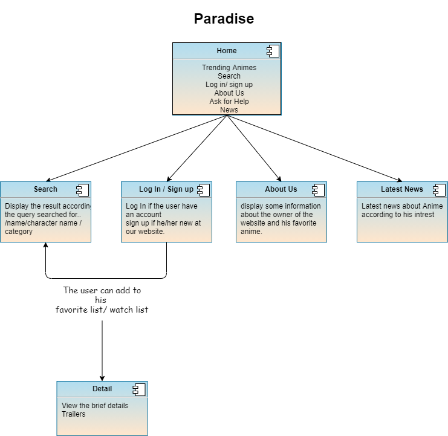

# WireFrame

- this is our Wireframe Will show you the Design of our website

## Home

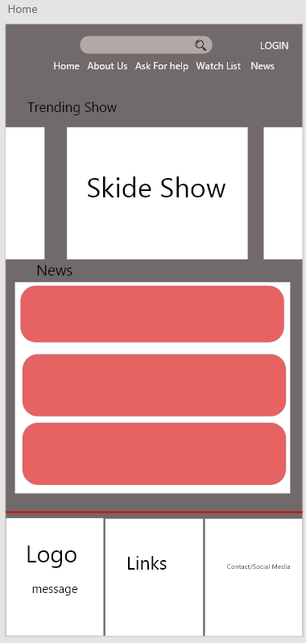

## Search

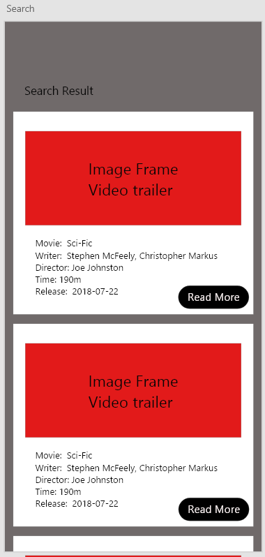

## Details

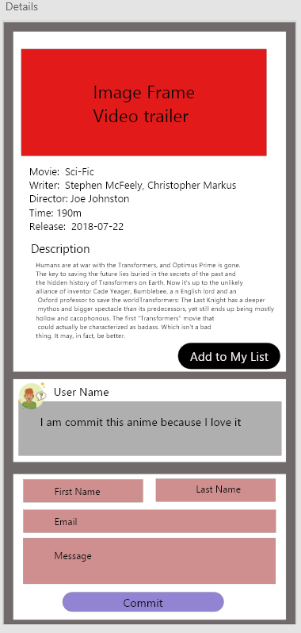

## About Us

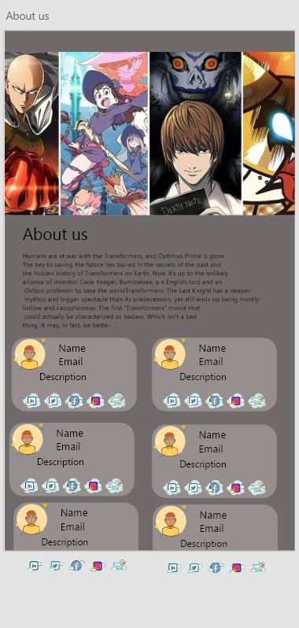

## Log in

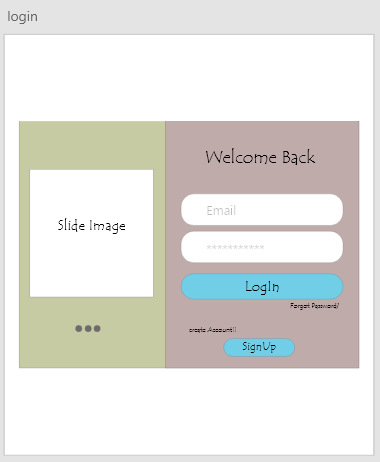

## Sign Up

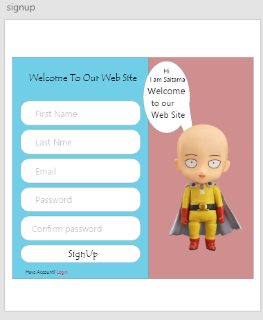

## My List

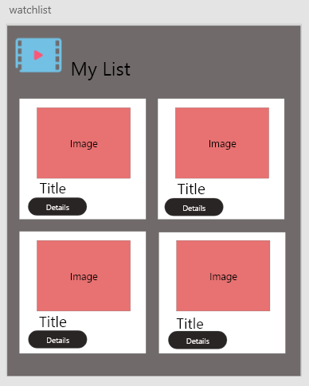

## Anime Details

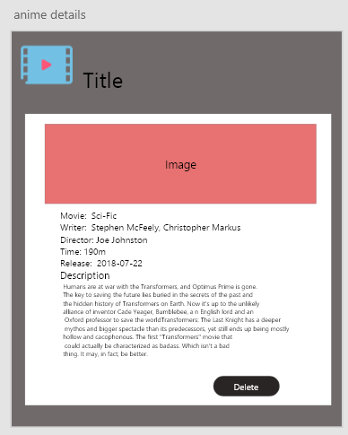

## Account / Profile

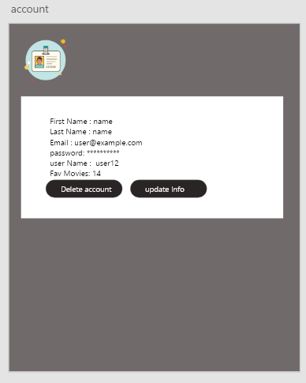

## Update Profile

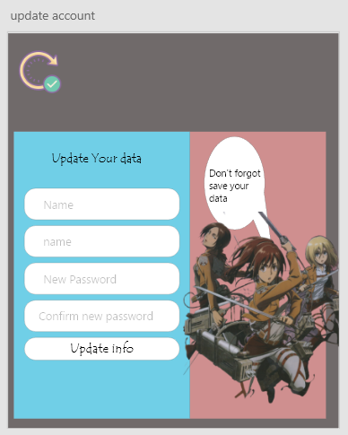

## Contact Us

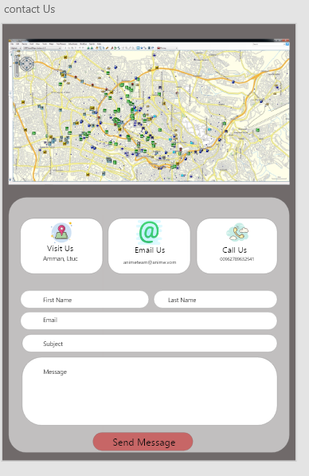
